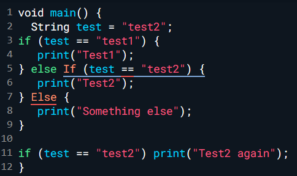
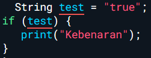
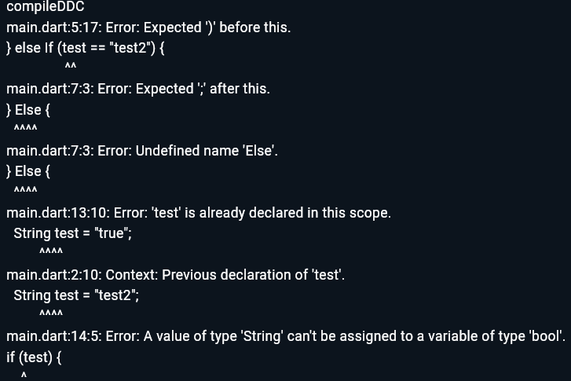
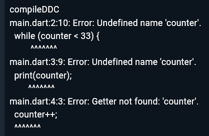

### Nama : Dhaneswara Haryo Satriagung <br>
### NIM : 2241720037 <br>
### Kelas : TI-2B <br><br>

## Praktikum 1: Menerapkan Control Flows ("if/else")
Selesaikan langkah-langkah praktikum berikut ini menggunakan DartPad di browser Anda.
### Langkah 1
Ketik atau salin kode program berikut ke dalam fungsi main().
<br>

### Langkah 2
Silakan coba eksekusi (Run) kode pada langkah 1 tersebut. Apa yang terjadi? Jelaskan!
<br>
```
Penjelasan
Kode tidak dapat dijalankan karena ada beberapa kesalahan dalam penulisan sintaks. Seperti 'If' dan 'Else' yang seharusnya ditulis dalam huruf kecil semua.
```

### Langkah 3
Tambahkan kode program berikut, lalu coba eksekusi (Run) kode Anda.
<br>
### Output
<br>
Apa yang terjadi ? Jika terjadi error, silakan perbaiki namun tetap menggunakan if/else.

### Perbaikan Error
```Dart
void main() {
  String test = "test2";
  if (test == "test1") {
    print("Test1");
  } else if (test == "test2") {
    print("Test2");
  } else {
    print("Something else");
  }
  if (test == "test2") print("Test2 again");

  bool test1 = true;
  if (test1 != false ) {
    print("Kebenaran");
  }else {
    print("Kesalahan");
  }
}
```
### Output
<br>

## Praktikum 2: Menerapkan Perulangan "while" dan "do-while"
Selesaikan langkah-langkah praktikum berikut ini menggunakan DartPad di browser Anda.
### Langkah 1
Ketik atau salin kode program berikut ke dalam fungsi main().
```Dart
  while (counter < 33) {
  print(counter);
  counter++;
}
```
### Langkah 2
Silakan coba eksekusi (Run) kode pada langkah 1 tersebut. Apa yang terjadi? Jelaskan! Lalu perbaiki jika terjadi error. <br>
<br>
```
Terjadi error karena variabel 'counter' tidak didefinisikan.
```
### Perbaikan
```Dart
void main() {
  int counter = 0;
  while (counter < 33) {
  print(counter);
  counter++;
}
}
```
### Output
```
0
1
2
3
4
5
6
7
8
9
10
11
12
13
14
15
16
17
18
19
20
21
22
23
24
25
26
27
28
29
30
31
32

```
### Langkah 3
Tambahkan kode program berikut, lalu coba eksekusi (Run) kode Anda.
``` Dart
void main() {
  int counter = 0;

  do {
  print(counter);
  counter++;
} while (counter < 77);
}
```
Apa yang terjadi ? Jika terjadi error, silakan perbaiki namun tetap menggunakan do-while.
```
0
1
2
3
4
5
6
7
8
9
10
11
12
13
14
15
16
17
18
19
20
21
22
23
24
25
26
27
28
29
30
31
32
33
34
35
36
37
38
39
40
41
42
43
44
45
46
47
48
49
50
51
52
53
54
55
56
57
58
59
60
61
62
63
64
65
66
67
68
69
70
71
72
73
74
75
76
```
```
Tidak terjadi error karena saya sudah mendefenisikan variabel 'counter' di awal. Yang terjadi adalah akan menghasilkan output angka 0 - 76.
```

## Praktikum 3: Menerapkan Perulangan "for" dan "break-continue"
Selesaikan langkah-langkah praktikum berikut ini menggunakan DartPad di browser Anda.
### Langkah 1
Ketik atau salin kode program berikut ke dalam fungsi main().
```Dart
void main() {
  
  for (Index = 10; index < 27; index) {
  print(Index);
}
}
```
### Langkah 2
Silakan coba eksekusi (Run) kode pada langkah 1 tersebut. Apa yang terjadi? Jelaskan! Lalu perbaiki jika terjadi error.
### Output
```
compileDDC
main.dart:3:20: Error: Undefined name 'index'.
  for (Index = 10; index < 27; index) {
                   ^^^^^
main.dart:4:9: Error: Undefined name 'Index'.
  print(Index);
        ^^^^^
main.dart:3:32: Error: Undefined name 'index'.
  for (Index = 10; index < 27; index) {
                               ^^^^^
main.dart:3:8: Error: Setter not found: 'Index'.
  for (Index = 10; index < 27; index) {
       ^^^^^

```
Terjadi error karena variabel index belum didefinisikan dan penulisan variabel yang harus diawali dengan huruf kecil. Selain itu, harus menggunakan 'index++' agar tidak terjadi infinte loop.

### Perbaikan
```Dart
void main() {
  
  for (int index = 10; index < 27; index++) {
  print(index);
}
}
```
### Output
```
10
11
12
13
14
15
16
17
18
19
20
21
22
23
24
25
26
```
### Langkah 3
Tambahkan kode program berikut di dalam for-loop, lalu coba eksekusi (Run) kode Anda.
``` Dart
If (Index == 21) break;
Else If (index > 1 || index < 7) continue;
print(index);
```
Apa yang terjadi ? Jika terjadi error, silakan perbaiki namun tetap menggunakan for dan break-continue.

### Output
```
compileDDC
main.dart:3:7: Error: Undefined name 'Index'.
  If (Index == 21) break;
      ^^^^^
main.dart:3:3: Error: Method not found: 'If'.
  If (Index == 21) break;
  ^^
main.dart:3:18: Error: Expected ';' after this.
  If (Index == 21) break;
                 ^
main.dart:3:20: Error: A break statement can't be used outside of a loop or switch statement.
Try removing the break statement.
  If (Index == 21) break;
                   ^^^^^
main.dart:4:3: Error: 'Else' isn't a type.
  Else If (index > 1 || index < 7) continue;
  ^^^^
main.dart:3:3: Error: Local variable 'If' can't be referenced before it is declared.
  If (Index == 21) break;
  ^^
main.dart:4:8: Context: This is the declaration of the variable 'If'.
  Else If (index > 1 || index < 7) continue;
       ^^
main.dart:4:8: Error: Expected ';' after this.
  Else If (index > 1 || index < 7) continue;
       ^^
main.dart:4:12: Error: Undefined name 'index'.
  Else If (index > 1 || index < 7) continue;
           ^^^^^
main.dart:4:25: Error: Undefined name 'index'.
  Else If (index > 1 || index < 7) continue;
                        ^^^^^
main.dart:4:34: Error: Expected ';' after this.
  Else If (index > 1 || index < 7) continue;
                                 ^
main.dart:4:36: Error: A continue statement can't be used outside of a loop or switch statement.
Try removing the continue statement.
  Else If (index > 1 || index < 7) continue;
                                   ^^^^^^^^
main.dart:4:36: Error: A continue statement in a switch statement must have a label as a target.
Try adding a label associated with one of the case clauses to the continue statement.
  Else If (index > 1 || index < 7) continue;
                                   ^^^^^^^^
main.dart:5:9: Error: Undefined name 'index'.
  print(index);
        ^^^^^
```

### Perbaikan
```Dart
void main() {
  for (int index = 7; index < 25; index++){
  if (index == 21) {
    break;
  } else if (index > 1 && index < 7) {
    continue;
  }
    print(index);
  }
}
```
### Output
```
7
8
9
10
11
12
13
14
15
16
17
18
19
20
```
## TUGAS PRAKTIKUM
Buatlah sebuah program yang dapat menampilkan bilangan prima dari angka 0 sampai 201 menggunakan Dart. Ketika bilangan prima ditemukan, maka tampilkan nama lengkap dan NIM Anda.
### SRC
```Dart
void main() {
  int start = 2;

  while (start <= 201) {
    bool prima = true;
    int i = 2;

    while (i <= start ~/ 2) {
      if (start % i == 0) {
        prima = false;
        break; 
      }
      i++;
    }

    if (prima) {
      print(start);
      print("Dhaneswara Haryo Satriagung, 2241720037");
    }

    start++; 
  }
}
```
### Output
```
2
Dhaneswara Haryo Satriagung, 2241720037
3
Dhaneswara Haryo Satriagung, 2241720037
5
Dhaneswara Haryo Satriagung, 2241720037
7
Dhaneswara Haryo Satriagung, 2241720037
11
Dhaneswara Haryo Satriagung, 2241720037
13
Dhaneswara Haryo Satriagung, 2241720037
17
Dhaneswara Haryo Satriagung, 2241720037
19
Dhaneswara Haryo Satriagung, 2241720037
23
Dhaneswara Haryo Satriagung, 2241720037
29
Dhaneswara Haryo Satriagung, 2241720037
31
Dhaneswara Haryo Satriagung, 2241720037
37
Dhaneswara Haryo Satriagung, 2241720037
41
Dhaneswara Haryo Satriagung, 2241720037
43
Dhaneswara Haryo Satriagung, 2241720037
47
Dhaneswara Haryo Satriagung, 2241720037
53
Dhaneswara Haryo Satriagung, 2241720037
59
Dhaneswara Haryo Satriagung, 2241720037
61
Dhaneswara Haryo Satriagung, 2241720037
67
Dhaneswara Haryo Satriagung, 2241720037
71
Dhaneswara Haryo Satriagung, 2241720037
73
Dhaneswara Haryo Satriagung, 2241720037
79
Dhaneswara Haryo Satriagung, 2241720037
83
Dhaneswara Haryo Satriagung, 2241720037
89
Dhaneswara Haryo Satriagung, 2241720037
97
Dhaneswara Haryo Satriagung, 2241720037
101
Dhaneswara Haryo Satriagung, 2241720037
103
Dhaneswara Haryo Satriagung, 2241720037
107
Dhaneswara Haryo Satriagung, 2241720037
109
Dhaneswara Haryo Satriagung, 2241720037
113
Dhaneswara Haryo Satriagung, 2241720037
127
Dhaneswara Haryo Satriagung, 2241720037
131
Dhaneswara Haryo Satriagung, 2241720037
137
Dhaneswara Haryo Satriagung, 2241720037
139
Dhaneswara Haryo Satriagung, 2241720037
149
Dhaneswara Haryo Satriagung, 2241720037
151
Dhaneswara Haryo Satriagung, 2241720037
157
Dhaneswara Haryo Satriagung, 2241720037
163
Dhaneswara Haryo Satriagung, 2241720037
167
Dhaneswara Haryo Satriagung, 2241720037
173
Dhaneswara Haryo Satriagung, 2241720037
179
Dhaneswara Haryo Satriagung, 2241720037
181
Dhaneswara Haryo Satriagung, 2241720037
191
Dhaneswara Haryo Satriagung, 2241720037
193
Dhaneswara Haryo Satriagung, 2241720037
197
Dhaneswara Haryo Satriagung, 2241720037
199
Dhaneswara Haryo Satriagung, 2241720037
```
E:\SMT 5\P. Mobile\Pertemuan 3\Laporan Pertemuan 3.md