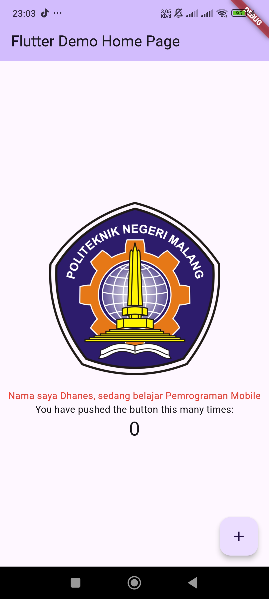
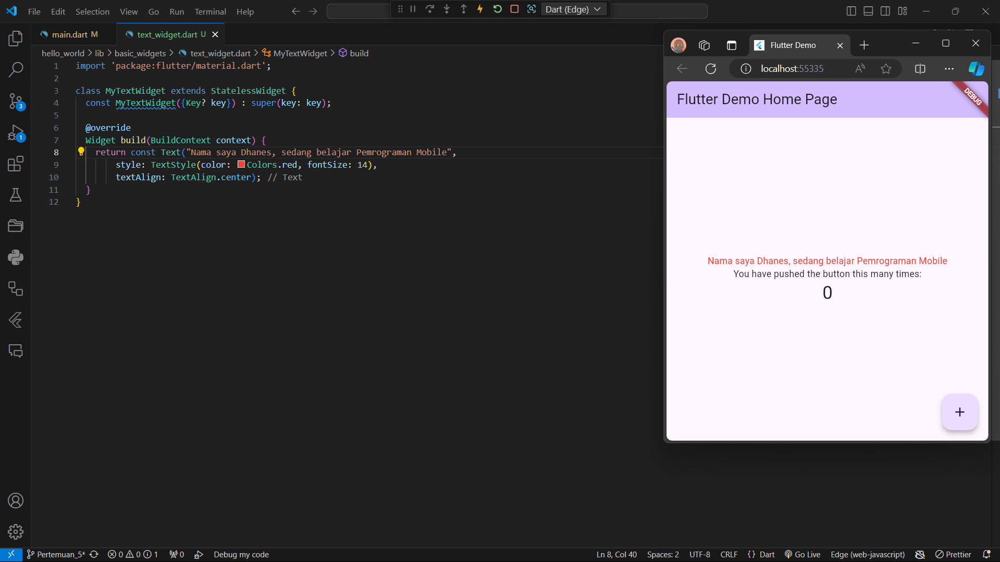
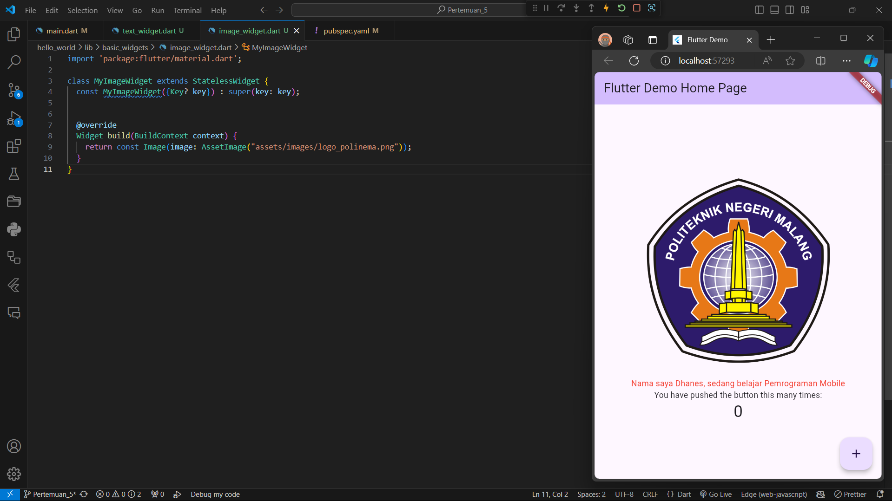
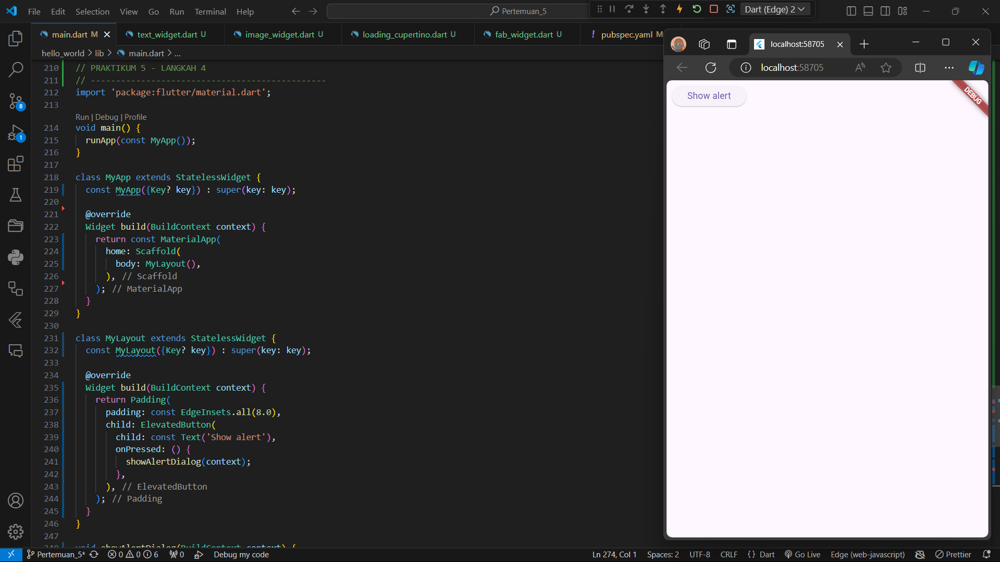
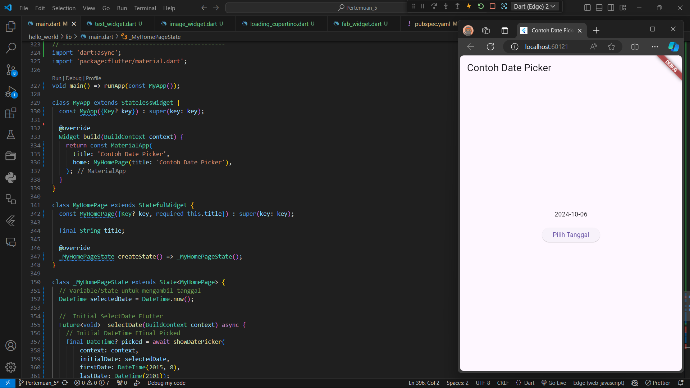
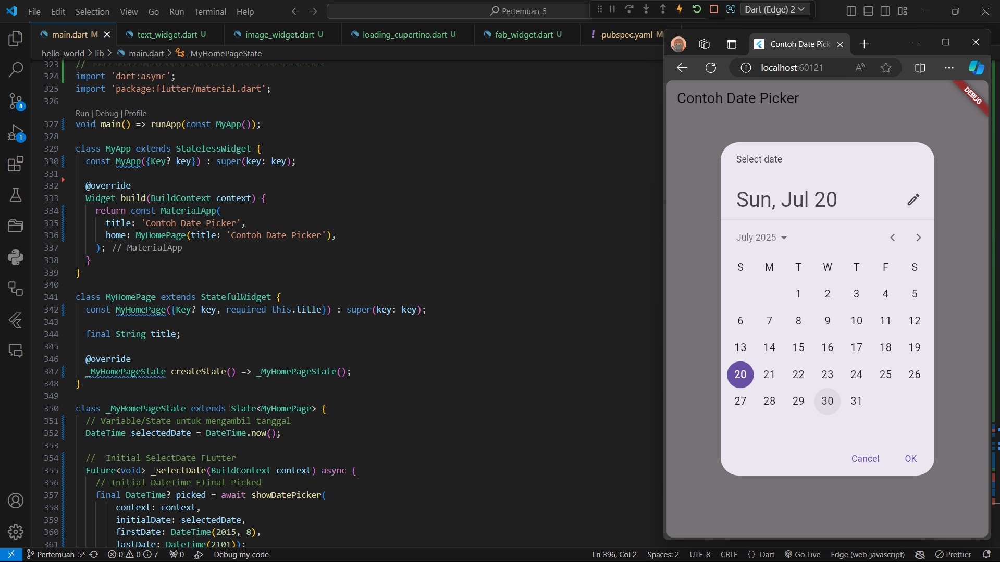
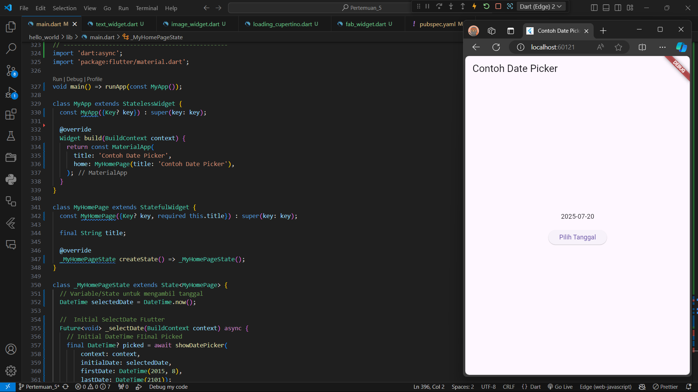

### NAMA : Dhaneswara Haryo Satriagung <br>
### NIM : 2241720037 / 09 <br>
### KELAS : TI-3B <br>

## PRAKTIKUM 1: Membuat Project Flutter Baru <br>
### Pembuatan Project Flutter "hello_world"<br>
<br>

## PRAKTIKUM 2: Menghubungkan Perangkat Android atau Emulator <br>
### HASIL
<br><br>
<br><br>
<br>


## PRAKTIKUM 3: Membuat Repository GitHub dan Laporan Praktikum <br>


## PRAKTIKUM 4: Menerapkan Widget Dasar<br>
### Langkah 1: Text Widget<br>
Buat folder baru basic_widgets di dalam folder lib. Kemudian buat file baru di dalam basic_widgets dengan nama text_widget.dart. Ketik atau salin kode program berikut ke project hello_world Anda pada file text_widget.dart.

```dart
import 'package:flutter/material.dart';

class MyTextWidget extends StatelessWidget {
  const MyTextWidget({Key? key}) : super(key: key);

  @override
  Widget build(BuildContext context) {
    return const Text("Nama saya Dhanes, sedang belajar Pemrograman Mobile",
        style: TextStyle(color: Colors.red, fontSize: 14),
        textAlign: TextAlign.center);
  }
}
```
Lakukan import file text_widget.dart ke main.dart, lalu ganti bagian text widget dengan kode di atas. Maka hasilnya seperti gambar berikut. Screenshot hasil milik Anda, lalu dibuat laporan pada file README.md.

```dart
import 'basic_widgets/text_widget.dart';
```

#### OUTPUT <br>
<br>

### Langkah 2: Image Widget<br>
Buat sebuah file image_widget.dart di dalam folder basic_widgets dengan isi kode berikut.<br>
```dart
import 'package:flutter/material.dart';

class MyImageWidget extends StatelessWidget {
  const MyImageWidget({Key? key}) : super(key: key);
  

  @override
  Widget build(BuildContext context) {
    return const Image(image: AssetImage("assets/images/logo_polinema.png"));
  }
}
```

Lakukan penyesuaian asset pada file pubspec.yaml dan tambahkan file logo Anda di folder assets project hello_world.<br>
```dart
flutter:
  assets:
     - logo_polinema.jpg
```
Jangan lupa sesuaikan kode dan import di file main.dart kemudian akan tampil gambar seperti berikut.<br>
```dart
import 'basic_widgets/image_widget.dart';
```
#### OUTPUT<br>
<br>

## PRAKTIKUM 5 <br>
### Langkah 1: Cupertino Button dan Loading Bar <br>
Buat file di basic_widgets > loading_cupertino.dart. Import stateless widget dari material dan cupertino. Lalu isi kode di dalam method Widget build adalah sebagai berikut.<br>
```dart
import 'package:flutter/cupertino.dart';
import 'package:flutter/material.dart';

class LoadingCupertino extends StatelessWidget {
  const LoadingCupertino({Key? key}) : super(key: key);

  @override
  Widget build(BuildContext context) {
    return MaterialApp(
      home: Container(
        margin: const EdgeInsets.only(top: 30),
        color: Colors.white,
        child: Column(
          children: <Widget>[
            CupertinoButton(
              child: const Text("Contoh button"),
              onPressed: () {},
            ),
            const CupertinoActivityIndicator(),
          ],
        ),
      ),
    );
  }
}
```

### Langkah 2: Floating Action Button (FAB) <br>
Button widget terdapat beberapa macam pada flutter yaitu ButtonBar, DropdownButton, TextButton, FloatingActionButton, IconButton, OutlineButton, PopupMenuButton, dan ElevatedButton.
```dart
import 'package:flutter/material.dart';

class FabWidget extends StatelessWidget {
  const FabWidget({Key? key}) : super(key: key);

  @override
  Widget build(BuildContext context) {
    return MaterialApp(
      home: Scaffold(
        floatingActionButton: FloatingActionButton(
          onPressed: () {
            // Add your onPressed code here!
          },
          backgroundColor: Colors.pink,
          child: const Icon(Icons.thumb_up),
        ),
      ),
    );
  }
}
```

Buat file di basic_widgets > fab_widget.dart. Import stateless widget dari material. Lalu isi kode di dalam method Widget build adalah sebagai berikut.<br>

### Langkah 3: Scaffold Widget <br>
Scaffold widget digunakan untuk mengatur tata letak sesuai dengan material design.

Ubah isi kode main.dart seperti berikut.<br>
```dart
import 'package:flutter/material.dart';

void main() {
  runApp(const MyApp());
}

class MyApp extends StatelessWidget {
  const MyApp({super.key});

  // This widget is the root of your application.
  @override
  Widget build(BuildContext context) {
    return MaterialApp(
      title: 'Flutter Demo',
      theme: ThemeData(
        primarySwatch: Colors.red,
      ),
      home: const MyHomePage(title: 'My Increment App'),
    );
  }
}

class MyHomePage extends StatefulWidget {
  const MyHomePage({super.key, required this.title});

  final String title;

  @override
  State<MyHomePage> createState() => _MyHomePageState();
}

class _MyHomePageState extends State<MyHomePage> {
  int _counter = 0;

  void _incrementCounter() {
    setState(() {
      _counter++;
    });
  }

  @override
  Widget build(BuildContext context) {
    return Scaffold(
      appBar: AppBar(
        title: Text(widget.title),
      ),
      body: Center(
        child: Column(
          mainAxisAlignment: MainAxisAlignment.center,
          children: <Widget>[
            const Text(
              'You have pushed the button this many times:',
            ),
            Text(
              '$_counter',
              style: Theme.of(context).textTheme.headlineMedium,
            ),
          ],
        ),
      ),
      bottomNavigationBar: BottomAppBar(
        child: Container(
          height: 50.0,
        ),
      ),
      floatingActionButton: FloatingActionButton(
        onPressed: _incrementCounter,
        tooltip: 'Increment Counter',
        child: const Icon(Icons.add),
      ),
      floatingActionButtonLocation: FloatingActionButtonLocation.centerDocked,
    );
  }
}
```
#### OUTPUT <br>
<br>

### Langkah 4: Dialog Widget <br>
Dialog widget pada flutter memiliki dua jenis dialog yaitu AlertDialog dan SimpleDialog.

Ubah isi kode main.dart seperti berikut.<br>
```dart
import 'package:flutter/material.dart';

void main() {
  runApp(const MyApp());
}

class MyApp extends StatelessWidget {
  const MyApp({Key? key}) : super(key: key);

  @override
  Widget build(BuildContext context) {
    return const MaterialApp(
      home: Scaffold(
        body: MyLayout(),
      ),
    );
  }
}

class MyLayout extends StatelessWidget {
  const MyLayout({Key? key}) : super(key: key);

  @override
  Widget build(BuildContext context) {
    return Padding(
      padding: const EdgeInsets.all(8.0),
      child: ElevatedButton(
        child: const Text('Show alert'),
        onPressed: () {
          showAlertDialog(context);
        },
      ),
    );
  }
}

void showAlertDialog(BuildContext context) {
  // set up the button
  Widget okButton = TextButton(
    child: const Text("OK"),
    onPressed: () {
      Navigator.pop(context);
    },
  );

  // set up the AlertDialog
  AlertDialog alert = AlertDialog(
    title: const Text("My title"),
    content: const Text("This is my message."),
    actions: [
      okButton,
    ],
  );

  // show the dialog
  showDialog(
    context: context,
    builder: (BuildContext context) {
      return alert;
    },
  );
}

```

#### OUTPUT <br>
<br>
<br>

### Langkah 5: Input dan Selection Widget <br>
Flutter menyediakan widget yang dapat menerima input dari pengguna aplikasi yaitu antara lain Checkbox, Date and Time Pickers, Radio Button, Slider, Switch, TextField.

Contoh penggunaan TextField widget adalah sebagai berikut:<br>
```dart
import 'package:flutter/material.dart';

void main() {
  runApp(const MyApp());
}

class MyApp extends StatelessWidget {
  const MyApp({Key? key}) : super(key: key);

  @override
  Widget build(BuildContext context) {
    return MaterialApp(
      home: Scaffold(
        body: Column(
          children: [
            // const MyLayout(),
            Container(
              margin: const EdgeInsets.all(16.0), // Adjust the margin as needed
              child: const TextField(
                obscureText: false,
                decoration: InputDecoration(
                  border: OutlineInputBorder(),
                  labelText: 'Nama',
                ),
              ),
            ),
            Container(
              margin: const EdgeInsets.all(16.0), // Adjust the margin as needed
              child: const TextField(
                obscureText: false,
                decoration: InputDecoration(
                  border: OutlineInputBorder(),
                  labelText: 'NIM',
                ),
              ),
            ),
          ],
        ),
      ),
    );
  }
}
```

#### OUTPUT <br>
<br>
<br>

### Langkah 6: Date and Time Pickers <br>
Date and Time Pickers termasuk pada kategori input dan selection widget, berikut adalah contoh penggunaan Date and Time Pickers.
```dart
import 'dart:async';
import 'package:flutter/material.dart';

void main() => runApp(const MyApp());

class MyApp extends StatelessWidget {
  const MyApp({Key? key}) : super(key: key);

  @override
  Widget build(BuildContext context) {
    return const MaterialApp(
      title: 'Contoh Date Picker',
      home: MyHomePage(title: 'Contoh Date Picker'),
    );
  }
}

class MyHomePage extends StatefulWidget {
  const MyHomePage({Key? key, required this.title}) : super(key: key);

  final String title;

  @override
  _MyHomePageState createState() => _MyHomePageState();
}

class _MyHomePageState extends State<MyHomePage> {
  // Variable/State untuk mengambil tanggal
  DateTime selectedDate = DateTime.now();

  //  Initial SelectDate FLutter
  Future<void> _selectDate(BuildContext context) async {
    // Initial DateTime FIinal Picked
    final DateTime? picked = await showDatePicker(
        context: context,
        initialDate: selectedDate,
        firstDate: DateTime(2015, 8),
        lastDate: DateTime(2101));
    if (picked != null && picked != selectedDate) {
      setState(() {
        selectedDate = picked;
      });
    }
  }

  @override
  Widget build(BuildContext context) {
    return Scaffold(
      appBar: AppBar(
        title: Text(widget.title),
      ),
      body: Center(
        child: Column(
          mainAxisSize: MainAxisSize.min,
          children: <Widget>[
            Text("${selectedDate.toLocal()}".split(' ')[0]),
            const SizedBox(
              height: 20.0,
            ),
            ElevatedButton(
              onPressed: () => {
                _selectDate(context),
                // ignore: avoid_print
                print(selectedDate.day + selectedDate.month + selectedDate.year)
              },
              child: const Text('Pilih Tanggal'),
            ),
          ],
        ),
      ),
    );
  }
}
```

#### OUTPUT <br>
<br>
<br>
<br>