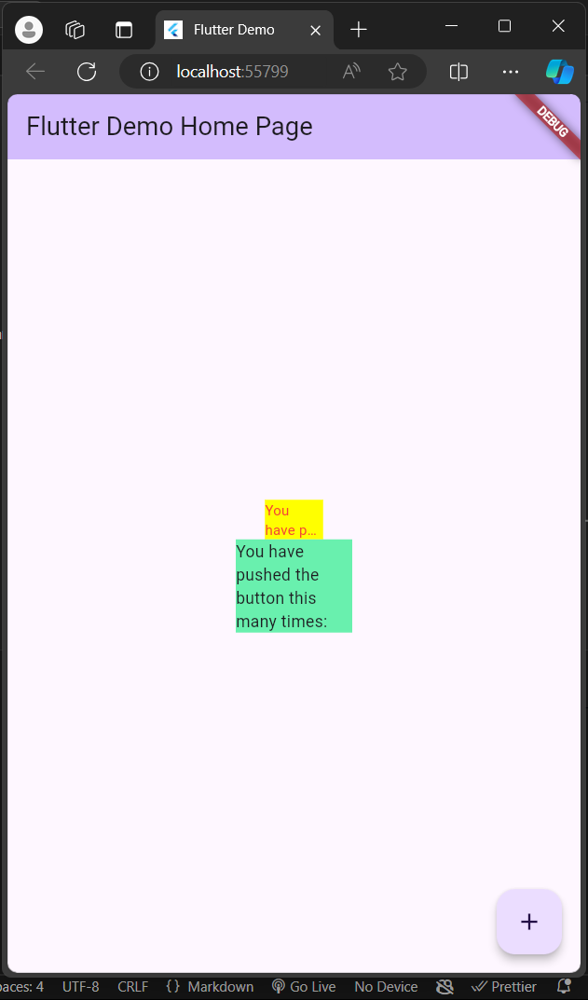

### Nama : Dhaneswara Haryo Satriagung <br>

### NIM : 2241720037 <br>

### Kelas : TI-3B <br>

# WEEK 7 - Praktikum Menerapkan Plugin di Project Flutter

### Langkah 1 - Buat Project Baru

Buatlah sebuah project flutter baru dengan nama flutter_plugin_pubdev. Lalu jadikan repository di GitHub Anda dengan nama flutter_plugin_pubdev.

### Langkah 2 - Menambahkan Plugin

Tambahkan plugin auto_size_text menggunakan perintah berikut di terminal

```
flutter pub add auto_size_text
```

Jika berhasil, maka akan tampil nama plugin beserta versinya di file pubspec.yaml pada bagian dependencies.

### Langkah 3 - Buat file red_text_widget.dart

Buat file baru bernama red_text_widget.dart di dalam folder lib lalu isi kode seperti berikut.

```dart
import 'package:flutter/material.dart';

class RedTextWidget extends StatelessWidget {
  const RedTextWidget({Key? key}) : super(key: key);

  @override
  Widget build(BuildContext context) {
    return Container();
  }
}
```

### Langkah 4 - Tambah Widget AutoSizeText

Masih di file red_text_widget.dart, untuk menggunakan plugin auto_size_text, ubahlah kode return Container() menjadi seperti berikut.

```dart
return AutoSizeText(
      text,
      style: const TextStyle(color: Colors.red, fontSize: 14),
      maxLines: 2,
      overflow: TextOverflow.ellipsis,
);
```

Setelah Anda menambahkan kode di atas, Anda akan mendapatkan info error. Mengapa demikian? Jelaskan dalam laporan praktikum Anda!
> Pada **Langkah 4**, setelah mengubah `return Container();` menjadi `return AutoSizeText(...)`, akan mengalami error karena belum menambahkan `import 'package:auto_size_text/auto_size_text.dart';` di bagian atas file `red_text_widget.dart`. Error ini terjadi karena widget `AutoSizeText` berasal dari plugin eksternal `auto_size_text` dan belum dikenali oleh proyek tanpa impor yang tepat. Agar widget tersebut dapat digunakan, Flutter perlu mengetahui sumber definisinya. Dengan menambahkan impor tersebut, kode akan mengenali dan menjalankan `AutoSizeText` tanpa error.

### Langkah 5 - Buat Variabel text dan parameter di constructor

Tambahkan variabel text dan parameter di constructor seperti berikut.

```dart
final String text;

const RedTextWidget({Key? key, required this.text}) : super(key: key);
```

### Langkah 6 - Tambahkan widget di main.dart

Buka file main.dart lalu tambahkan di dalam children: pada class \_MyHomePageState

```dart
Container(
   color: Colors.yellowAccent,
   width: 50,
   child: const RedTextWidget(
             text: 'You have pushed the button this many times:',
          ),
),
Container(
    color: Colors.greenAccent,
    width: 100,
    child: const Text(
           'You have pushed the button this many times:',
          ),
),
```
# Tugas Praktikum
1. Selesaikan Praktikum tersebut, lalu dokumentasikan dan push ke repository Anda berupa screenshot hasil pekerjaan beserta penjelasannya di file README.md!
### Output
<br><br>
2. Jelaskan maksud dari langkah 2 pada praktikum tersebut!
> Pada Langkah 2, langkah ini menambahkan plugin auto_size_text ke dalam proyek Flutter dengan menggunakan perintah flutter pub add auto_size_text. Perintah ini akan memasukkan auto_size_text sebagai dependensi di file pubspec.yaml, lengkap dengan nama dan versi plugin. Plugin auto_size_text berguna untuk membuat widget AutoSizeText, yang secara otomatis menyesuaikan ukuran teks agar sesuai dengan ruang yang tersedia, sehingga membantu menjaga tata letak teks tetap proporsional.

3. Jelaskan maksud dari langkah 5 pada praktikum tersebut!
> Pada Langkah 5, ditambahkan variabel text dan parameter di dalam constructor widget RedTextWidget. Deklarasi variabel text bertujuan untuk menyimpan teks yang akan ditampilkan oleh widget AutoSizeText. Kemudian, dengan menambahkan parameter required this.text pada constructor RedTextWidget, widget ini dapat menerima input teks dari luar ketika dipanggil. Dengan pendekatan ini, widget menjadi lebih fleksibel, karena teks yang ditampilkan bisa disesuaikan sesuai kebutuhan.

4. Pada langkah 6 terdapat dua widget yang ditambahkan, jelaskan fungsi dan perbedaannya!
> Pada Langkah 6, terdapat dua widget yang ditambahkan di dalam children pada kelas _MyHomePageState. Widget pertama adalah Container berwarna kuning yang menggunakan RedTextWidget untuk menampilkan teks dengan warna merah dan ukuran font yang dapat menyesuaikan ruang secara otomatis menggunakan AutoSizeText. Fungsi RedTextWidget ini adalah menampilkan teks yang bisa menyesuaikan ukuran font jika ruangnya terbatas.
Widget kedua adalah Container berwarna hijau yang menampilkan teks menggunakan widget Text biasa. Perbedaannya, widget Text tidak memiliki kemampuan untuk menyesuaikan ukuran font otomatis seperti AutoSizeText, sehingga teks mungkin terpotong jika ruangnya tidak mencukupi.

5. Jelaskan maksud dari tiap parameter yang ada di dalam plugin auto_size_text berdasarkan tautan pada dokumentasi ini!
- `text`: Parameter ini menerima string yang akan ditampilkan oleh `AutoSizeText`.
- `style`: Parameter ini menentukan gaya teks, seperti warna, ukuran font, dan jenis font. Pada contoh ini, gaya teks diatur dengan warna merah dan ukuran font default 14.
- `maxLines`: Parameter ini mengatur jumlah baris maksimum yang diizinkan untuk teks. Jika teks melebihi batas baris, ukuran font akan disesuaikan agar teks tetap sesuai di dalam batas baris yang ditetapkan.
- `overflow`: Parameter ini mengatur bagaimana teks yang tidak muat ditampilkan. Dalam contoh, `TextOverflow.ellipsis` digunakan agar teks yang terpotong ditandai dengan titik-titik di akhir. 

6. Kumpulkan laporan praktikum Anda berupa link repository GitHub kepada dosen!