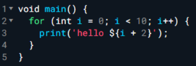
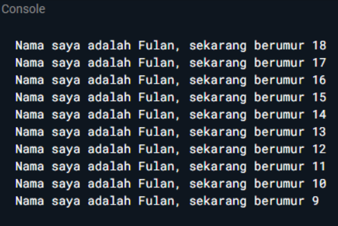
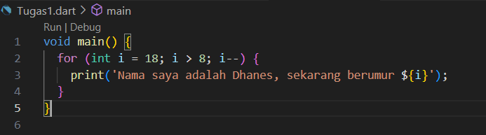
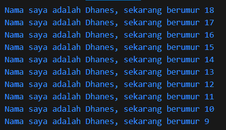

### Nama : Dhaneswara Haryo Satriagung <br>
### NIM : 2241720037 <br>
### Kelas : TI-2B <br><br>

# PERTEMUAN 2 <br>
<br>**Soal 1**<br>
Modifikasilah kode pada baris 3 di VS Code atau Editor Code favorit Anda berikut ini agar mendapatkan keluaran (output) sesuai yang diminta!<br>
<br>

<br>Output yang diminta:<br>
<br>

## Jawab
### Src
<br>
### Output
<br>


**Soal 2** <br>
Mengapa sangat penting untuk memahami bahasa pemrograman Dart sebelum kita menggunakan framework Flutter ? Jelaskan!
```
Memahami Dart sebelum menggunakan Flutter sangat penting karena Dart adalah fondasi utama dari Flutter. Semua komponen dan logika dalam aplikasi Flutter dibangun menggunakan bahasa pemrograman Dart. Dengan menguasai Dart, maka akan lebih mudah dalam menulis kode yang efisien, melakukan debugging, dan memanfaatkan fitur-fitur canggih yang ditawarkan oleh Flutter. Selain itu, pemahaman terhadap konsep-konsep dasar pemrograman dalam Dart akan membantu kita dalam membangun aplikasi yang lebih berkualitas dan scalable. Singkatnya, Dart adalah kunci untuk membuka potensi penuh dari Flutter.
```

**Soal 3** <br>
Rangkumlah materi dari codelab ini menjadi poin-poin penting yang dapat Anda gunakan untuk membantu proses pengembangan aplikasi mobile menggunakan framework Flutter.
```
Apa itu bahasa pemrograman Dart?
Bahasa pemrograman Dart merupakan dasar dari framework Flutter. Untuk memastikan pengalaman pengembangan yang optimal dan menciptakan aplikasi seluler yang hebat, Flutter memerlukan bahasa pemrograman modern dan canggih seperti Dart.

A. Fitur Dart
    a. Productive tooling
    b. Garbage collection
    c. Type annotations 
    d. Statically typed
    e. Portability

B. Evolusi Dart
    a. Diluncurkan pada tahun 2011. Lalu pada tahun 2013 dirilis versi stabilnya.
    b. Tujuan awal dari dart untuk menggantikan bahasa JavaScript.
    c. Menawarkan performa terbaik dan alat yang lebih baik untuk proyek berskala besar
    d. Dibentuk agar kuat dan fleksibel

C. Bagaimana Dart Bekerja?
    Dart adalah bahasa pemrograman yang mendukung berbagai jenis aplikasi, dari web hingga mobile. Ia bekerja dengan mengubah kode Dart menjadi kode native untuk aplikasi mobile atau JavaScript untuk aplikasi web. Dart memiliki dua cara kompilasi: JIT untuk pengembangan cepat dan AOT untuk performa tinggi saat aplikasi siap digunakan. Dart juga menyediakan alat modern dan fitur seperti keamanan null untuk membantu pengembang membuat aplikasi yang efisien dan berkinerja baik.

D. Operator Dart
    a. Operator Aritmatika
        a.1. + (Penjumlahan)
        a.2. - (Pengurangan)
        a.3. * (Perkalian)
        a.4. / (Pembagian)
        a.5. % (Sisa bagi)

    b. Operator Perbandingan
        b.1. == (Sama dengan)
        b.2. != (Tidak sama dengan)
        b.3. > (Lebih besar dari)
        b.4. < (Kurang dari)
        b.5. >= (Lebih besar atau sama dengan)
        b.6. <= (Kurang dari atau sama dengan)

    c. Operator Logika
        c.1. && (Dan logika)
        c.2. || (Atau logika)
        c.3. ! (Negasi)
```